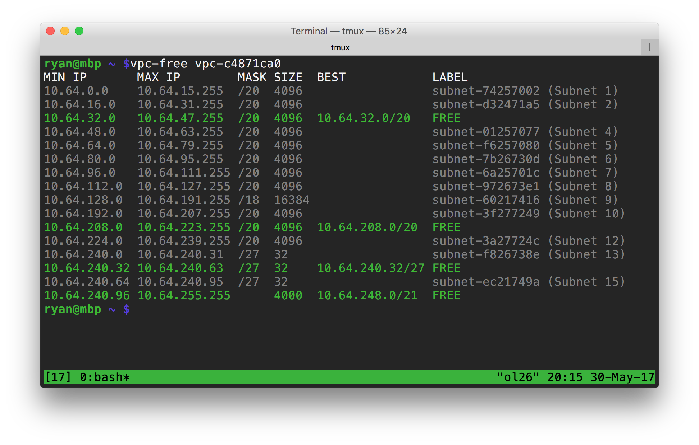

vpc-free
========

This script searches for the largest available IP subnets within the unallocated
spaces between your VPC subnets, or between VPCs for a given CIDR block.

Installation
------------

Install ``vpc-free`` to ``/usr/local/bin`` with:

.. code-block:: shell

    $ pip install vpc-free

The script uses the Amazon AWS SDK (``boto3``) to connect to AWS. The SDK must
be configured with credentials to connect to the AWS APIs. Please see the `Boto3
documentation`_ for instruction.

.. _Boto3 Documentation: http://boto3.readthedocs.io/en/latest/guide/quickstart.html#configuration

Usage
-----

.. code-block:: shell

    $ vpc-free -h
    usage: vpc-free [-h] TARGET

    Find free IP blocks in AWS EC2.

    positional arguments:
      TARGET      CIDR, VPC ID or VPC Name to search

    optional arguments:
      -h, --help  show this help message and exit

Examples
--------

.. code-block:: shell

    # search for unallocated blocks between VPCs in 10.0.0.0/8
    $ vpc-free 10.0.0.0/8
    MIN IP    MAX IP         MASK SIZE     BEST         LABEL
    10.0.0.0  10.63.255.255  /10  4194304  10.0.0.0/10  FREE
    10.64.0.0 10.64.255.255  /16  65536                 vpc-c4871ca0 (Demo)
    10.65.0.0 10.255.255.255      12517376 10.128.0.0/9 FREE

    # search for unallocated block between subnets in a VPC
    $ vpc-free vpc-c4671caf
    10.64.0.0  10.64.15.255  /20  4096                 subnet-74247002 (Subnet 1)
    10.64.16.0 10.64.31.255  /20  4096                 subnet-d32421a5 (Subnet 2)
    10.64.32.0 10.64.47.255  /20  4096  10.64.32.0/20  FREE
    10.64.48.0 10.64.63.255  /20  4096                 subnet-0a257077 (Subnet 4)
    10.64.64.0 10.64.255.255      49152 10.64.128.0/17 FREE
